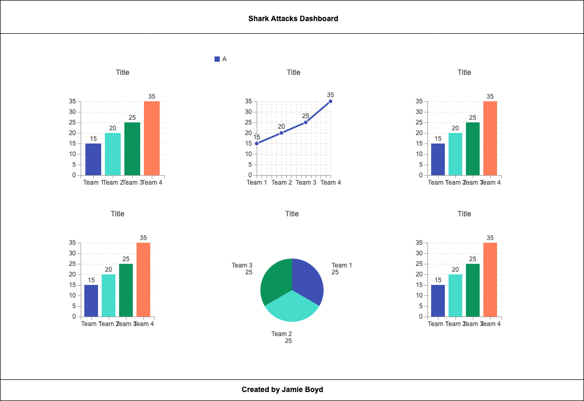
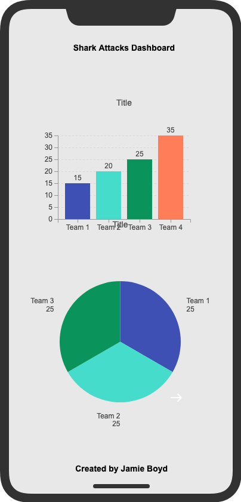

# Milestone Project 2
## Description
---
This is my second milestone project on the Full Stack Developer course by Code Institute. The aim is to create a responsive mobile first appraoch dashboard, which contains several dynamic charts, to visualise various dimensiions of a chosen dataset.

I chose to use a dataset based on global shark attacks as this is something that I find interesting. This is purely a front-end project so no manipulation of the data has taken place on the back-end. This is purely a visualisation of data that is already in the file.

My dataset is based upon global shark attacks from 2000 - 2018 on the top 10 affected countries.

[Dashboard Website](https://jboyd8.github.io/milestone-project-2/)

## UX
---
I chose a very specific color theme for the dahboard based ont he topic involved. As it was based upon Shark Attack data I wanted to use nature colors which is how I decided upon blues and greens. I used an off white color for the font
for a bit of contrast. I felt tried to keep an element of repetition throughout the web pahe to provide the best user experience possible. This allows a user to learn how the website works quickly. In addition to this, I also provided some instructions on the site so that the user knows exactly how it works. As this was a dashboard project, I wanted to create a one page site. I feel as though this is the best way to show case the data at hand.

In terms of the font, I chose Cabin bcecause I felt it still looked very professional whilst still being sleek. I felt the need for it to still look professional on a dashboard was very important.

By utilising crossfilter.js and dc.js, I ensured the user could have some control over the data they wanted to see. On initial load up, all the data presented is unfiltered, and with the inclusin of some dropdown bars, and the clickable charts, users have the ability to filter information how they see fit.

I included a button in the footer to enable a user to go straight up to the top of the page rather than scrolling back up to enhance user experience. I also added a button in the footer to allow all charts to be reset for the same reason.

I have added the full chart at the bottom of the page so that users have the option to look through the whole dataset should the need arise.

I have shared my wireframes below, however, the final site looks quite different. As I was developing the site, it became apparent that there was a better way for the data to be visualized, as well as allowing the data to be responsive on all devices, which was at the forefront of my design process. I initially wanted to go with a really simple design that just plainly showed the charts. However, upon development, I saw ways in which I can improve 

### User Stories
* I want to be able to view the number of Shark Attacks by country (top ten)
* I want to be able to view the number of Shark Attacks by Year
* I want to be able to filter by state for the Shark Attacks.
* I want to be able to filter data.

### Wireframes
#### Desktop

## Features
---
#### Current Features
The current features of this dashboard include multiple interactive charts. By clicking on any value in any of the charts, all other charts
will filter accordingly.
Charts include:
* Shark Attacks by Year
* Shark Attacks By Country
* Shark Attacks by Type
* Shark Attacks by Area
* Shark Attacks by Outcome (fatal or not)

#### Future Features
Future features will depends on the data available. I would like to add a chart to show attacks by species. The data in the species column of this
dataset was not complete.

## Technologies/Support Used
---
Below is a list of technolgies I used to build my dahsboard.
* HTML - HTML5 provided the structure of my website. I tried to use semantic elements where possible to ensure the best structure.
* CSS - Used to style my page.
* [Bootstrap](https://getbootstrap.com/) - Used primarily for the grid system. I find this a really good way to position my elements where I want them.
* [VSCode](https://code.visualstudio.com) - This is my text editor. It has a built in terminal so I could do everything I needed to from one environment.
* [Git](https://git-scm.com) - Git was used for version control. Allowing me to create backups whenever significant changes were made to my code.
* [GitHub](https://github.com/) - This is where my repository is held externally. I will aslo use GitHub pages to deploy my website.
* [Javascript/Jquery](https://jquery.com/) - Utilised jQuery to manipulate the DOM and add HTML.
* [d3.js](https://d3js.org/) - This is the library that Crossfilter.js and DC.js are built on top of.
* [crossfilter.js](https://github.com/crossfilter/crossfilter) - I utilised this to make my charts interactive by allowing them to be filtered.
* [dc.js](https://dc-js.github.io/dc.js/) - Used to build all charts in dashboard.
* [Google Fonts](https://fonts.google.com/) - Used to import specific fonts I wanted to use on my website.

## Testing
---
I have both manually and automatically tested the website throughout the development of the project. I used the web developer tools consistenly to ensure my website was responsive, firstly at mobile screen sizes, and then at larger screen sizes. I used the device feature of dev tools to test the build on all devices available. The automatic checks of my HTML and CSS structure were done in W3C Validator to ensure there were no errors and they were both structured correctly. I did the same tests for JS using JSHint. I did this continuously throughout the process. Additionally, to ensure that my website was responsive across different browsers, I downloaded other browsers onto my machine so I could test the build in those too. My default browser is Google Chrome which is where I did the majority of my tests. I find this the best tool to use when developing a website as I can refer to the developer tools when required. I also tested the build on Safari, Firefox, IE, Edge and Opera, although these were done periodically. Currently, the website appears and fuctions exactly as it should on all browsers, with the exception of IE and Edge (see bugs section for more details).

If there was an error on my page, I would first change the styles etc in the dev tools so i could see a live update in the browser. Once I had figured out the issue I would then go back to VS Code and make the changes there. I also tried to commit my changes as much as possible. Like the testing I did this on an ongoing basis throughout development to ensure I had lots of versions, and I could go back to a previous version should a major error occur. If there was an error with in the JS, I would first check it out on the console to see if there were any errors,. If so, I would try to fix based on that. I also used console.log alot if I was getting unexpected values. This allowed me to understand what was going on and allowed me to fix the issue.

Additionally to the above, I also provided my GitHub pages link to various people in order to rigorously test the website, both on mobile and desktop. I had users click on all the buttons to ensure they were acting according to my JS. I requested users to ensure they could scroll on the graphs on all browsers and screen sizes to ensure the full graph could be seen. I also posted the link to my website in the Slack to get feedback from other students in the community.

## Bugs
---
I have added overflow scroll to my charts via CSS. I was unable to find a way to make my charts responsive with the version of dc.js i am using, so this was the most visually pleasing way I could do it. I will continue to look for a solution to make the charts reposnive to different screen sizes.

The 'back to top' isnt working on IE. I have been able to find a solution to this yet.

## Deployment
---
My website was created using VSCode. VSCode is a text editor with a built in terminal. I chose to use a text editor/IDE outside of AWS Cloud9 to gain experience working outside of a browser. Once I had created my file strcuture and first HTML page, i initiated a local repository using GIT which was downloaded onto my machine previously. I then created an external repository in GitHub and linked the local and external repositories. This allowed me to version control throughout the lifespan of the development.

* I created a new environment in VS Code
* In the bash terminal, entered 'git init'
* Created all my folders and files.
* Entered 'git add .' into the bash terminal
* Entered 'git commit' into the bash terminal and created my initial commit
* I then linked my local git repository to a GitHub repository.
* I then followed the below steps to deploy the site to GitHub pages.

To deploy the website to GitHub pages, I followed the below steps:
* Selected the milestone-project-1 from my GitHub dashboard.
* Selected 'Settings' from the menu bar.
* From the GitHub pages section, I chose 'master branch' from the dropdown menu.
* Once selected, the page refreshed and a link was displayed in the GitHub pages section to my wesbite.
* [Website Link](https://jboyd8.github.io/milestone-project-2/)

### To run this project locally

* Follow this link to the [GitHub Repositiry](https://github.com/jboyd8/milestone-project-2)
* Click on the 'Clone or Download' button.
* Copy the URL provided.
* Open a bash terminal, move to your desired directory.
* Type 'git clone' and paste in the URL.

## Credits
---
* To my mentor, [Reuben Ferrante](https://github.com/arex18), for guding me through the process and offering assistance when neccesary to point me in the right direction.
* The Slack community. The help a student is able to receive from the other students is a really great tool to have.
* [HTML Color Code](https://htmlcolorcodes.com/) - Used this website in order to obtain hex codes whilst styling my pages.
* [Clip Art Mag](http://clipartmag.com/) - Used this free website to get the favicon for my website.
* [W3C Validator](https://validator.w3.org/#validate_by_input) - A validator used to check my HTML and CSS structure and format periodically throughout the build.
* [JSHint](https://jshint.com/) - Used to run JS code through as part of testing.
* [Cacoo](https://app.cacoo.com/o/8g0cBCgjuA/recent) - Used to build wireframes.

#### Copied Code
I used the basis of this code on Stack Overflow and adapted it to work with my own code. This allowed me to create objects containing the counts of each occurence of a piece of data in a particular column. 
Which then allowed me to calculate the percentages for each chart. 
